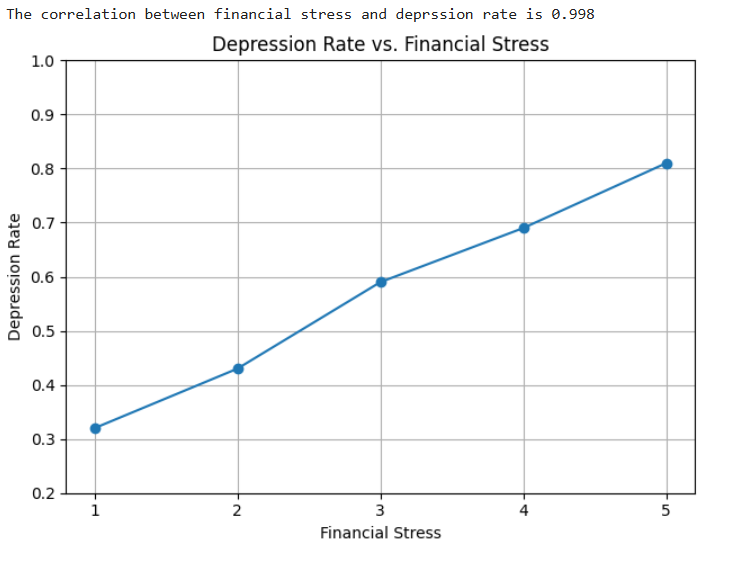

# eda-depression-students
Here is a direct link to the CSV I used in my project: 
https://www.kaggle.com/datasets/adilshamim8/student-depression-dataset

EDA Project Summary:

This project involved an Exploratory Data Analysis (EDA) of a dataset focused on depression among students. The initial exploration included examining the data's structure, checking for missing values and anomalies, and inferring the dataset's origin (likely India) based on the city information. The analysis then focused on understanding the relationship between depression and various factors such as academic degree level, study hours, academic performance (grades), dietary habits, and family history of mental illness. Interestingly, a strong positive correlation was found between depression and study hours. Furthermore, the potential influence of financial stress as a confounding factor was explored, suggesting it could underlie some of the observed correlations. The notebook aimed to answer initial questions about these relationships while also highlighting further avenues for investigation.

I chose this particular graph because it visually highlights a potentially significant relationship identified in the data – the correlation between students' levels of depression and their reported financial stress. This connection is interesting as it suggests that economic pressures might play a considerable role in students' mental well-being, and it opens up further questions about the direction and underlying causes of this relationship.

DataCamp's courses have been really helpful in learning data science, and they prepared me well for this project. I did the EDA on Kaggle, which has a comfortable workspace. The only thing I found a bit tricky there was getting the Plotly graphs to work correctly.
